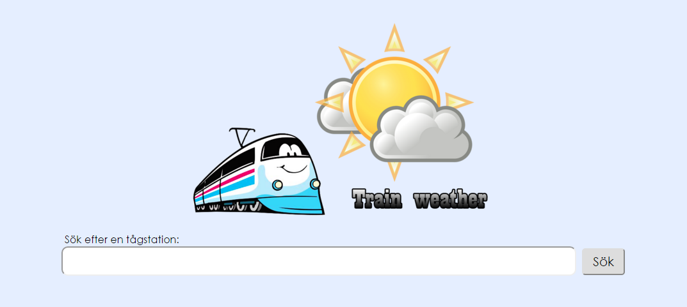
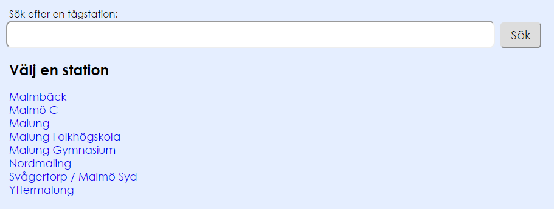
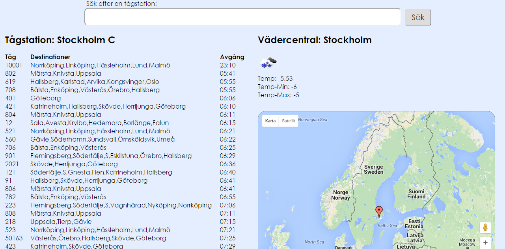

# Projektrapport

### Inledning
Jag har skapat en applikation som är till för tågresenärer. De kan innan sin resa gå in och söka efter olika tågstationer och se hur vädret ser ut vid den station de valt. Känner själv att applikationen inte är något som kommer användas allt för mycket, men jag hade svårt att komma på något projekt jag ville göra och därför blev det detta. I dagsläget så finns det inga liknande applikationer som jag vet om, i alla fall inte i Sverige.

Jag har använt mig av PHP när jag skapat applikationen. Känner mig trygg med språket och jag kände att jag enklast kunde skapa min applikation med det. Jag har följt MVC och även använt mig av Javascript till bland annat "Offline-first" och Google Maps.

*Startsidan innehåller en sökbox där användaren ska skriva in ett ortnamn.*

*Användaren får upp olika alternativ för tågstationer.*

*Användaren väljer ett alternativ och får upp tågstationens avgångar, vädret och en karta.*

### Säkerhet och prestandaoptimering
Vad det gäller säkerhet så har jag försökt göra applikationen så stabil och säker som möjligt. Jag har först och främst gått igenom OWASPs lista med vanliga säkerhetshål. Jag har bland annat gjort så att det inte går att göra XSS-attacker på applikationen. Det ska inte gå att skicka in skadlig kod, för att få tillgång till t.ex. användares cookies, sessioner och annan viktig data.

Jag har även försökt förhindra Cross Site Request Forgery-attacker. Där handlar det om samma sak, att jag har validerat all inläst data från sökboxen. Det ska inte gå att skicka in olika taggar, ex. script, vilket gör att det inte ska gå att gör dessa attacker.

Något jag kunde förbättrat med säkerheten är att det inte ska gå att få tag i vissa cache-filer som finns på servern. Jag tycker säkerheten är lagom bra, då det inte går att få tag i länkarna i källkoden till dessa filer. Men får läcker dessa länkar ut så är det enkelt att ladda ner filerna. Visserligen innehåller filerna bara cachad information från API:erna.

Angående prestandan på min applikation så har jag även där tänkt på många saker. Jag har bland annat försökt hålla ned på antalet scripts och stylesheets. Ju fler filer som måste laddas in, ju fler förfrågningar måste skicka för att hämta dem. Varje förfrågningar tar tid och det gör att inläsningstiden blir längre.

Jag har valt att ha min ena stylesheet-fil i början av koden, i ”Head-taggen”. Det gör att sidan laddas in gradvis och man ser hur sidan utvecklas med alla element. Hade jag lagt filen mitt i, eller i slutet i koden så hade det i stort sett laddats lika fort, men användaren hade gått stirra på en vit sida innan all kod laddats in.

Lite samma sak är det med script, fast tvärtom. Alla script har jag lagt i slutet av koden. När ett script laddas in så kan inget annat laddas in samtidigt. Så om jag lägger mina scripts i mitten utav koden så kommer sidan utvecklas i en hackig takt. När jag lägger dem i slutet så har alla element laddats in och det kommer knappt synas att scripten laddas in därefter.

För att göra så få förfrågningar mot API:erna så har jag valt att cacha data som ska användas ofta. Data som kommer från API:et med tågstationer har jag valt att cacha i en dag. Det kommer ske många sökningar vilket innebär många onödiga förfrågningar mot API:et. Jag skulle också kunnat cacha temperatur och avgångar men har inte riktigt fått det att fungera.

### Offline-first
Jag har försökt göra applikationen till en bra offline-applikation. Tanken från början var att kunna använda Javascript när jag läste in från API:erna. Tyvärr lyckades jag inte lösa det när jag försökte läsa in från Tågtiders API. Därför kunde jag inte heller spara API:ets information på klienten och då inte kunde ta del av den informationen när användaren inte var uppkopplad. 

Jag har istället gjort så att användaren ska informeras om när hen inte är uppkopplad. Försöker användaren söka på något eller klicka på någon länk på sidan så kommer applikationen inte ta användaren vidare. Istället kommer en blinkande text upp med information om att användaren inte är uppkopplad. När användaren hamnat i offline-läge så gör applikationen kontroller var femte sekund för att se om internetuppkopplingen fungerar igen. När sedan uppkopplingen är tillbaka så går applikationen in i online-läge igen.

Kartan från Google Maps är också skapad som så att den sparar lite information när man är online, vilket gör att när man sedan är offline kan man fortfarande använda den. Detta är lite begränsat när man ska zooma in på kartan.

I en sådan här applikation så kanske ett offline-läge inte är så viktigt. Det är inte ofta du stannar på sidan under en längre tid. Oftast går du in och gör max en till tre sökningar på platser som man vill ha information om. Självklart blir det en bättre upplevelse om sidan inte kraschar utan uppkoppling.

### Risker
Det finns alltid risker med mashup-applikationer. Den största risken för applikationen är om ett API går ner eller ändras. Då kommer inte applikationen fungera som den ska. Förhoppningsvis så fångas fel och visas som felmeddelanden, men detta lär ändå inte användarna gilla. 

### Egna reflektioner
Jag tycker mitt arbete med projektet har gått bra. Jag hade en klar idé om hur applikationen skulle se ut och resultatet blev som förväntat. Något jag fick problem med under mitt arbete var det här med ”offline-first”. Problemet var att jag hade använt mig av PHP och gjort nästintill hela applikationen i det språket. När jag sedan skulle jobba med ”offline-first”-delen så var det svårt att få in Javascript-funktioner. Allt data ligger på servern och jag kunde inte riktigt hämta datan genom Javascript, vilket gjorde att jag inte kunde lagra den datan på klienten. 

Jag hade gärna velat jobbat mer med ”offline-first” och verkligen bygga en applikation som fungerar ännu bättre utan uppkoppling än vad min applikation gör.

Jag vill väl tyvärr inte jobba vidare med min applikation så mycket. Jag tycker att jag valde fel när jag skulle välja projekt. Hade lite problem med att hitta något vettigt att göra, så det blev något jag inte brann för. 
